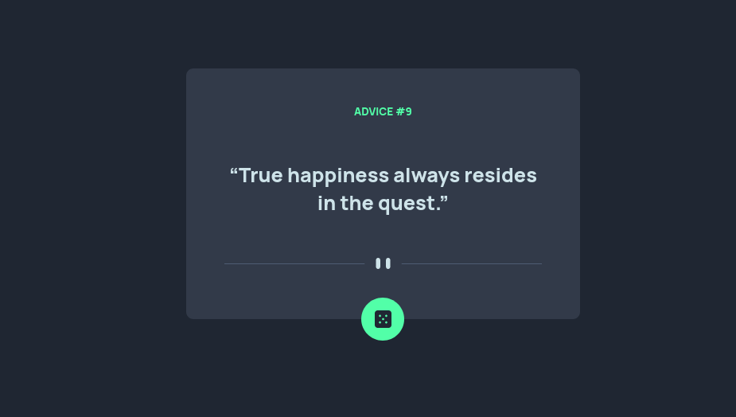

# Frontend Mentor - Advice generator app solution

This is a solution to the [Advice generator app challenge on Frontend Mentor](https://www.frontendmentor.io/challenges/advice-generator-app-QdUG-13db). Frontend Mentor challenges help you improve your coding skills by building realistic projects.

## Table of contents

-   [Overview](#overview)
    -   [The challenge](#the-challenge)
    -   [Screenshot](#screenshot)
    -   [Links](#links)
-   [My process](#my-process)
    -   [Built with](#built-with)
    -   [Useful resources](#useful-resources)
-   [Author](#author)

## Overview

### The challenge

Users should be able to:

-

### Screenshot

### Links

-   Solution URL: [Advice-generator](https://github.com/olamide203/advice-generator)
-   Live Site URL: [Advice-generator](https://olamide203.github.io/advice-generator/)

## My process

### Built with

-   Semantic HTML5 markup
-   CSS custom properties
-   CSS Grid
-   Mobile-first workflow
-   Fetch API

### Useful resources

-   [Advice slip API](https://api.adviceslip.com/) - Advice slip REST API for fetching random jokes

## Author

-   Frontend Mentor - [@olamide203](https://www.frontendmentor.io/profile/olamide203)
-   Twitter - [@olamide_farouq](https://www.twitter.com/olamide_farouq)
